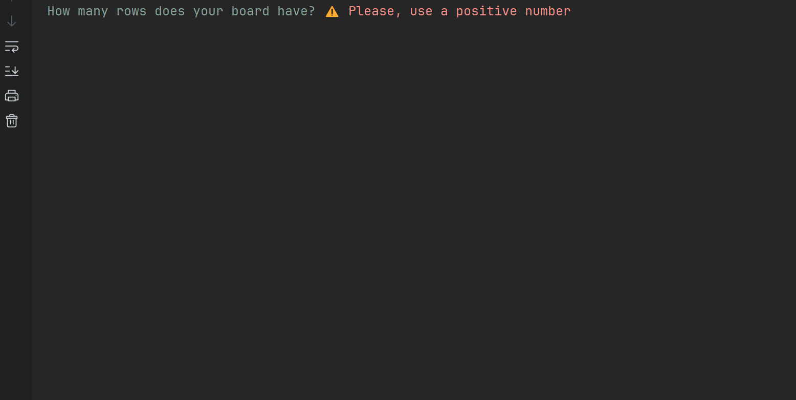

# ⭐ DAM - Exercise 1 

### Objective 🎯
---
Creating a Bomberman-like game just using the console and
- Not using modular style
- Not using advanced programming techniques or approaches

### How does the app work ⚙️
---
1. Ask for a number of Rows to the user
2. Ask for a number of Columns to the user
3. Create the board using the Rows and Columns (in an array)
4. Fill the array with random numbers from 1 to 9, both included
5. Show menu to the user (0 - Quit, 1 - See the board, 2 - Plant bomb, 3 - See ranking)
6. Wait for user input to execute the chosen option

| Option nº     | Option name | Description |
| ----------- | ----------- | ----------- |
| 0      | **Quit** | Quits the game       |
| 1   | **Show board** | Shows the board created with user inputs for: rows, columns. Filled with random numbers from 1 to 9, both included. After that, shows the menu again.        |
| 2   | **Plant bomb** | User must provide with X and Y coordinates to plant a bomb and earn a score. This choice checks if the game is over or not. If its over, closes the program. If not, shows the menu again.        |
| 3   | **Ranking** | Shows the global total ranking for the current match. Scores are not saved in between matches.        |

### Demo GIF 📹
---

